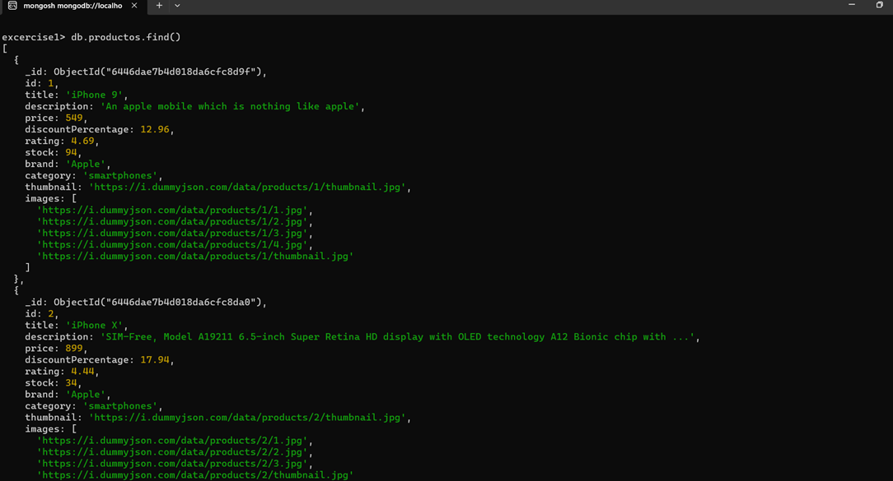
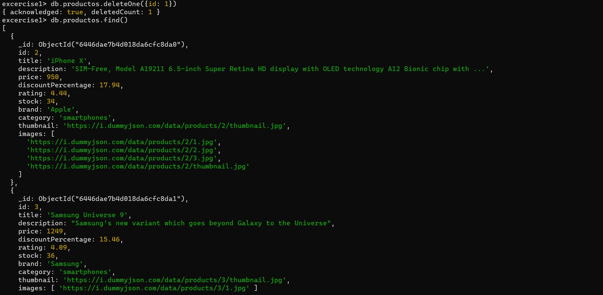

# MongoDB homework.

Type | Command | Image 
:--- | :--- | :---
Fin all | ` db.productos.find();`|  
Update One | ` db.productos.updateOne({id: 2},{$set:{price:950}})` |  
Delete One | `db.productos.deleteOne({id: 1})` | 
